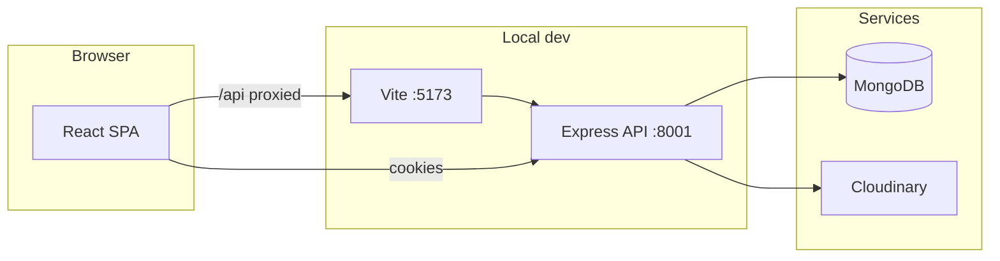

<div align="center">

# Playtube

**A full-stack YouTube-style experience** — watch, upload, subscribe, manage a studio, playlists, library, and community posts — with cookie-based auth, Cloudinary media, and a production-minded React UI.

[](https://nodejs.org/)
[](https://react.dev/)
[](https://www.typescriptlang.org/)
[](https://vitejs.dev/)
[](https://www.mongodb.com/)
[](https://expressjs.com/)

</div>

---

## Contents

- [Overview](#overview)
- [Features](#features)
- [Architecture](#architecture)
- [Repository layout](#repository-layout)
- [Quick start](#quick-start)
- [Production deploy (Render + Vercel + Atlas)](#production-deploy-render--vercel--atlas)
- [Environment](#environment)
- [Scripts](#scripts)
- [Production build](#production-build)
- [Implementation phases](#implementation-phases)

---

## Overview

Playtube pairs an **Express 5 + MongoDB** REST API under `/api/v1` with a **Vite + React 19 + TypeScript** SPA. The browser uses **HTTP-only cookies** for access and refresh tokens; the frontend wraps `fetch` with automatic refresh on `401`.

Media (avatars, covers, videos, thumbnails) is uploaded through the API to **Cloudinary**. Local development proxies `/api` to the backend so you can run both servers without CORS friction.

---

## Production deploy (Render + Vercel + Atlas)

**Order: deploy the API first, then the SPA** (the UI build needs `VITE_API_URL`).

Full checklist, env tables, and troubleshooting: **[`docs/DEPLOY.md`](docs/DEPLOY.md)**.

Summary:

1. **Atlas** — allow network access; `MONGODB_URI` without a `/playtube` suffix (the app appends `/playtube`).
2. **Render** — Web service, root `backend`, `npm install` / `npm start`, set `NODE_ENV`, `MONGODB_URI`, `CORS_ORIGIN` (your Vercel URL), **`COOKIE_SAMESITE=none`**, JWT + Cloudinary.
3. **Vercel** — root `frontend`, set **`VITE_API_URL`** to your Render API origin (no trailing slash).
4. Update **`CORS_ORIGIN`** on Render to match the final Vercel URL and redeploy the API if needed.

Optional: [`render.yaml`](render.yaml) Blueprint skeleton (secrets still in the Render dashboard).

---

## Features

| Area | What you get |
|------|----------------|
| **Auth** | Register, login, logout, protected routes, session refresh |
| **Home** | Paginated video feed, client-side search on loaded items, infinite scroll |
| **Watch** | Player, metadata, like, subscribe, comments, watch history, save to playlist |
| **Channel** | Profile, banner, subscribe, videos & load more, playlists, **Community** (tweets) |
| **Studio** | Dashboard stats, CRUD-style video management, publish toggle |
| **Playlists** | View; owners edit meta, remove videos, delete playlist |
| **Library** | History, liked videos, subscriptions + merged feed |
| **Settings** | Profile PATCH, password change, avatar & cover multipart uploads |
| **UX** | Global toasts, route-level lazy loading + Suspense, page titles (`react-helmet-async`), skip link and focus-visible affordances |

---

## Architecture



In **production**, the static `dist/` app calls the API using `VITE_API_URL` (full origin, no trailing slash).

---

## Repository layout

```
playtube/
├── backend/          # Express API, Mongoose models, Cloudinary
│   ├── .env.sample   # Copy → .env
│   └── src/
├── frontend/         # Vite + React + TypeScript
│   ├── .env.example
│   └── src/
│       ├── api/      # Typed fetch helpers + endpoints
│       ├── components/
│       ├── context/  # Auth, toasts
│       └── pages/
└── README.md         # You are here
```

More detail for each package: [`backend/README.md`](backend/README.md) · [`frontend/README.md`](frontend/README.md).

---

## Quick start

### 1. Prerequisites

- **Node.js** (LTS)
- **MongoDB** (local or Atlas)
- A **[Cloudinary](https://cloudinary.com/)** account (uploads)

### 2. Backend

```bash
cd backend
cp .env.sample .env
# Edit .env: MONGODB_URI, JWT secrets, Cloudinary, CORS_ORIGIN (see below)

npm install
npm run dev
```

Default API URL: **http://localhost:8001**

### 3. Frontend

```bash
cd frontend
npm install
npm run dev
```

Default UI: **http://localhost:5173**

The Vite dev server proxies **`/api`** to `VITE_DEV_API_PROXY` if set, otherwise **http://localhost:8001**. All API calls use **`credentials: 'include'`** so cookies flow on the same site during dev.

---

## Environment

Do not commit real secrets. Use the sample files and keep `.env` gitignored.

### Backend (`backend/.env`)

| Variable | Purpose |
|----------|---------|
| `PORT` | API port (default `8001`) |
| `MONGODB_URI` | Base URI; app uses database `playtube` per backend constants |
| `CORS_ORIGIN` | Allowed browser origin for cookies (e.g. `http://localhost:5173`) |
| `ACCESS_TOKEN_SECRET` / `REFRESH_TOKEN_SECRET` | JWT signing (use long random strings in production) |
| `ACCESS_TOKEN_EXPIRY` / `REFRESH_TOKEN_EXPIRY` | Token lifetimes |
| `CLOUDINARY_*` | Cloud name, API key, API secret |

Full template: [`backend/.env.sample`](backend/.env.sample).

### Frontend (`frontend/.env`)

| Variable | When |
|----------|------|
| `VITE_DEV_API_PROXY` | Optional; overrides default `http://localhost:8001` for the dev proxy target |
| `VITE_API_URL` | **Required for production builds** — absolute API origin, no trailing slash (e.g. `https://api.example.com`) |

Template: [`frontend/.env.example`](frontend/.env.example).

---

## Scripts

| Location | Command | Description |
|----------|---------|-------------|
| `backend/` | `npm run dev` | Nodemon + Express with `dotenv` |
| `frontend/` | `npm run dev` | Vite dev server |
| `frontend/` | `npm run build` | Typecheck + production bundle → `dist/` |
| `frontend/` | `npm run preview` | Serve `dist/` locally |
| `frontend/` | `npm run lint` | ESLint |

---

## Production build

```bash
cd frontend
set VITE_API_URL=https://your-api.example.com   # Windows PowerShell: $env:VITE_API_URL="..."
npm run build
```

Deploy **`frontend/dist/`** behind your static host and point **`VITE_API_URL`** at the live API. Ensure **`CORS_ORIGIN`** on the server matches the exact origin users load the SPA from, or cookies will not stick.

---

## Implementation phases

High-level delivery map for this repo (phases are documentation only; not separate packages).

| Phase | Scope | Status |
|-------|--------|--------|
| 0 | App shell, layout, routes, API client, UI primitives | Done |
| 1 | Design tokens, video card motion, responsive grid polish | Done |
| 2 | Auth forms, session, `RequireAuth`, redirects | Done |
| 3 | Home feed, pagination / infinite scroll, search on loaded set | Done |
| 4 | Watch page, likes, subscribe, comments, history, save to playlist | Done |
| 5 | Channel profile, videos, playlists, subscribe | Done |
| 6 | Upload (multipart), Studio | Done |
| 7 | Playlist page, owner controls | Done |
| 8 | Library: history, liked, subscriptions + merged feed | Done |
| 9 | Settings: account, password, avatar & cover | Done |
| 10 | Toasts, Suspense/lazy routes, a11y pass, SEO titles | Done |
| 11 | Community / tweets on channel (`/api/v1/tweets`), Studio dashboard stats | Done |

**Note:** The “liked” state on the watch page may not reflect a prior like until interaction if the video detail endpoint does not include a server-side “liked by me” flag — behavior depends on API payload.

---

## License

ISC (backend `package.json`). Add or align a root **LICENSE** file if you redistribute the project.
